# Lab 3 — Splunk SIEM & Log Analysis

## Overview

This lab demonstrates an end-to-end Splunk SIEM deployment on Microsoft Azure, covering log ingestion from a Windows Server domain controller, SPL query writing, security dashboard construction, and automated brute-force detection alerting — reflecting real-world SOC analyst workflows.

**Splunk Version:** Enterprise 10.x — 60-day trial, then permanently free at 500 MB/day  
**Platform:** Microsoft Azure — Ubuntu 22.04 (Splunk Indexer) · Windows Server 2025 (DC01 log source)  
**Log Source:** Splunk Universal Forwarder on DC01 → Security, System, Application Event Logs  
**Certification Alignment:** CompTIA Security+ · CySA+ · Splunk Core Certified User

---

## Business Context

A medium-sized organization generates millions of log events every day — authentication events from Active Directory, service starts and stops from Windows servers, and application errors across the environment. Without a SIEM, those logs sit in separate systems with no way to search across them, correlate events, or detect attack patterns automatically.

The SIEM is the SOC's primary tool. When an alert fires, the analyst opens the SIEM and searches logs to build a timeline: what happened, when, from where, and what was affected. Splunk is the most widely deployed commercial SIEM in enterprise environments. Hands-on Splunk experience — writing SPL, building dashboards, configuring scheduled alerts — appears on job descriptions for nearly every SOC Analyst and Security Engineer role.

This lab also demonstrates the Universal Forwarder architecture used in real enterprise Splunk deployments: a lightweight agent installed on every server ships logs to a central indexer, giving the SOC a single searchable view across the entire environment.

---

## Prerequisites

- Azure subscription with permissions to create Resource Groups, VMs, VNets, and NSGs
- Azure CLI installed locally (`az --version` to verify) and authenticated (`az account show`)
- GitHub CLI installed locally (`gh --version` to verify) and authenticated (`gh auth status`)
- Splunk account (free — use [temp-mail.org](https://temp-mail.org/en/) to register)
- Windows PowerShell for SSH to the Ubuntu VM (built-in on Windows 10/11 — no extra install needed)

---

## Architecture

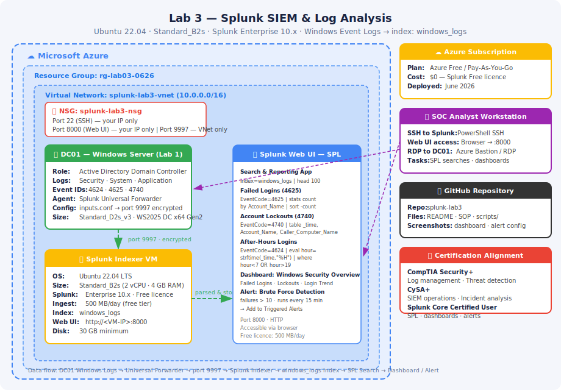

**Data flow:** DC01 Windows Event Logs → Universal Forwarder (port 9997, encrypted) → Splunk Indexer (Ubuntu 22.04) → `windows_logs` index → SPL searches → Dashboards & Alerts

| Resource | Name | Detail |
|---|---|---|
| Resource Group | `rg-lab03-0626` | Contains all lab resources |
| Log Source VM | `DC01` | Windows Server 2025 Datacenter x64 Gen2, Standard_D2s_v3 |
| Splunk Indexer VM | `splunk-vm` | Ubuntu 22.04 LTS, Standard_D2as_v4 |
| Virtual Network | `splunk-lab3-vnet` | Shared VNet — private IP routing between VMs |
| NSG — DC01 | `dc01-nsg` | Allows RDP (3389) from your IP only |
| NSG — Splunk | `splunk-nsg` | Allows SSH (22) and Splunk UI (8000) from your IP · port 9997 from VNet only |

> **What gets installed where:**  
> Ubuntu VM → Splunk Enterprise (the SIEM — all indexing, searching, and alerting lives here)  
> DC01 Windows Server → Splunk Universal Forwarder only (lightweight agent that ships Event Logs to Ubuntu VM)  
> Your local machine → nothing (access everything via browser and PowerShell SSH)

---

## Steps

### 1. Initialize the Project Repository

Create the local project directory, initialize Git, and scaffold the folder structure.

```powershell
cd C:\Users\828co\OneDrive\Documents\Repos
mkdir splunk-lab3
cd splunk-lab3
git init
echo "# Lab 3 — Splunk SIEM & Log Analysis" > README.md
mkdir scripts screenshots
git add .
git commit -m "initial commit: splunk lab3 project structure"
gh repo create splunk-lab3 --public --source=. --remote=origin --push
```
---

### 2. Deploy Both VMs with Azure CLI

VMs are torn down after each lab. Run these commands to rebuild the full environment from scratch.

```powershell
# Confirm you are logged into the correct Azure account
az account show --query "{Name:name, SubscriptionId:id, State:state}" --output table

# If not logged in, or wrong account:
az login
az account set --subscription "<SubscriptionId or Name>"
```

```powershell
# Set variables — edit before running
$RG       = "rg-lab03-0626"
$LOCATION = "westus2"
$VNET     = "splunk-lab3-vnet"
$SUBNET   = "lab3-subnet"
$ADMIN    = "labadmin"
$PASSWORD = "LabPass456!@#"   # change this

# Resource group + VNet
az group create --name $RG --location $LOCATION

az network vnet create `
  --resource-group $RG --name $VNET `
  --address-prefix 10.0.0.0/16 `
  --subnet-name $SUBNET --subnet-prefix 10.0.1.0/24
```

**Deploy DC01 (Windows Server 2025)**

```powershell
az network nsg create --resource-group $RG --name dc01-nsg

az network nsg rule create --resource-group $RG --nsg-name dc01-nsg `
  --name Allow-RDP --priority 1000 --protocol Tcp `
  --destination-port-ranges 3389 `
  --source-address-prefixes YOUR_PUBLIC_IP --access Allow

az vm create `
  --resource-group $RG --name DC01 `
  --image "MicrosoftWindowsServer:WindowsServer:2025-datacenter-g2:latest" --size Standard_D2s_v3 `
  --vnet-name $VNET --subnet $SUBNET --nsg dc01-nsg `
  --admin-username $ADMIN --admin-password $PASSWORD `
  --location $LOCATION --security-type TrustedLaunch `
  --public-ip-sku Standard

# Save DC01 private IP — needed for the forwarder config in Step 5
az vm list-ip-addresses --resource-group $RG --name DC01 `
  --query "[].virtualMachine.network.privateIpAddresses[0]" --output tsv
```

**Deploy Splunk VM (Ubuntu 22.04)**

```powershell
az network nsg create --resource-group $RG --name splunk-nsg

az network nsg rule create --resource-group $RG --nsg-name splunk-nsg `
  --name Allow-SSH --priority 1000 --protocol Tcp `
  --destination-port-ranges 22 --source-address-prefixes YOUR_PUBLIC_IP --access Allow

az network nsg rule create --resource-group $RG --nsg-name splunk-nsg `
  --name Allow-SplunkUI --priority 1010 --protocol Tcp `
  --destination-port-ranges 8000 --source-address-prefixes YOUR_PUBLIC_IP --access Allow

az network nsg rule create --resource-group $RG --nsg-name splunk-nsg `
  --name Allow-Forwarder-VNet --priority 1020 --protocol Tcp `
  --destination-port-ranges 9997 --source-address-prefixes 10.0.0.0/16 --access Allow

az vm create `
  --resource-group $RG --name splunk-vm `
  --image Ubuntu2204 --size Standard_D2as_v4 `
  --vnet-name $VNET --subnet $SUBNET --nsg splunk-nsg `
  --admin-username $ADMIN --admin-password $PASSWORD `
  --location $LOCATION --public-ip-sku Standard

# Save both IPs — public for browser/SSH, private for forwarder
az vm list-ip-addresses --resource-group $RG --name splunk-vm `
  --query "[].virtualMachine.network.{Public:publicIpAddresses[0].ipAddress,Private:privateIpAddresses[0]}" `
  --output table
```

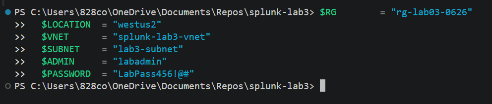

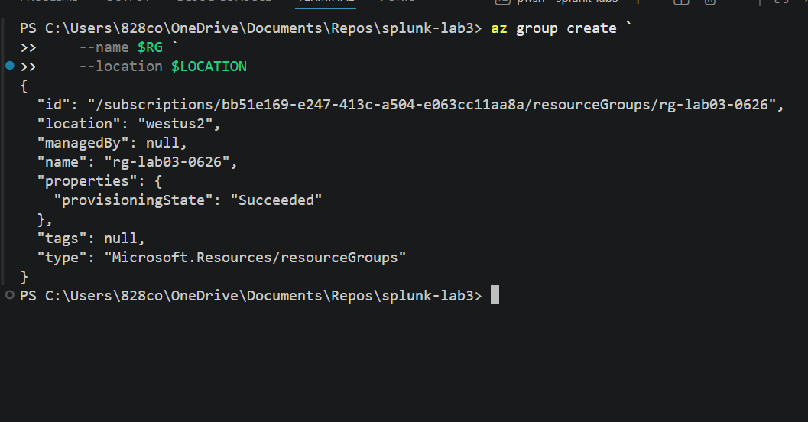

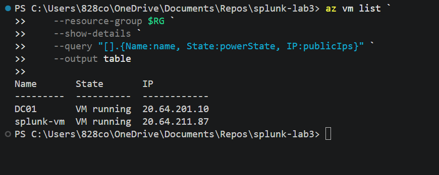

---

### 3. Create Splunk Account and Get the Download URL

Nothing downloads to your local machine in this step. The installer is downloaded directly onto the Ubuntu VM in Step 4 via `wget`. This step exists only to get past Splunk's registration wall.

1. Go to [splunk.com/en_us/download/splunk-enterprise.html](https://splunk.com/en_us/download/splunk-enterprise.html)
2. Register with a temporary email from [temp-mail.org](https://temp-mail.org/en/) — check the inbox there for the confirmation link
3. Select **Linux → .deb package** — then **copy the `wget` command** shown on the page (do not click Download). You'll paste it on the Ubuntu VM in Step 4.

> You want **Splunk Enterprise** — not Splunk Cloud and not Splunk SOAR. The wget URL in Step 4 may be outdated — always use the one copied from the download page.

---

### 4. Install and Configure Splunk on the Ubuntu VM

SSH into the Splunk VM from PowerShell on your local machine:

```powershell
ssh labadmin@<SPLUNK_VM_PUBLIC_IP>
```

Type `yes` when prompted about the host fingerprint. No characters appear when typing the password — this is normal Linux behavior.

```bash
# Paste the wget command copied from splunk.com (Linux .deb — NOT Windows .msi)
# Do not use a hardcoded URL — Splunk updates versions frequently
wget -O splunk-<version>-linux-amd64.deb \
  "https://download.splunk.com/products/splunk/releases/<version>/linux/splunk-<version>-<hash>-linux-amd64.deb"

# Install — wildcard matches whatever version you downloaded
sudo dpkg -i splunk-*-linux-amd64.deb

# Start Splunk — credentials may be prompted here or during enable boot-start
# --run-as-root required in Splunk 9.x+ when using sudo
sudo /opt/splunk/bin/splunk start --accept-license --answer-yes --run-as-root

# Enable auto-start on reboot
sudo /opt/splunk/bin/splunk enable boot-start
```

Open the Splunk web UI in your browser: `http://<SPLUNK_VM_PUBLIC_IP>:8000`

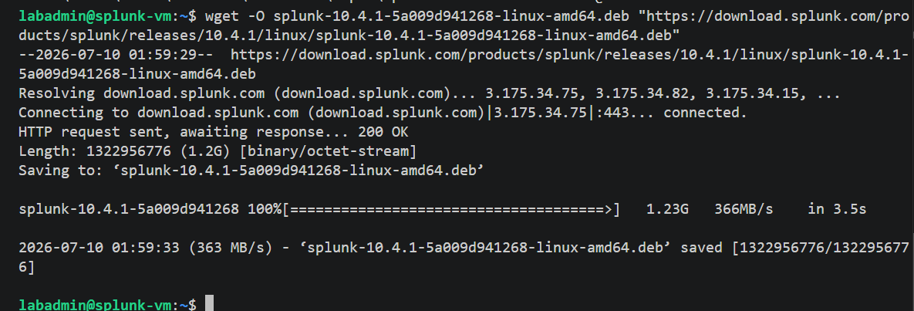

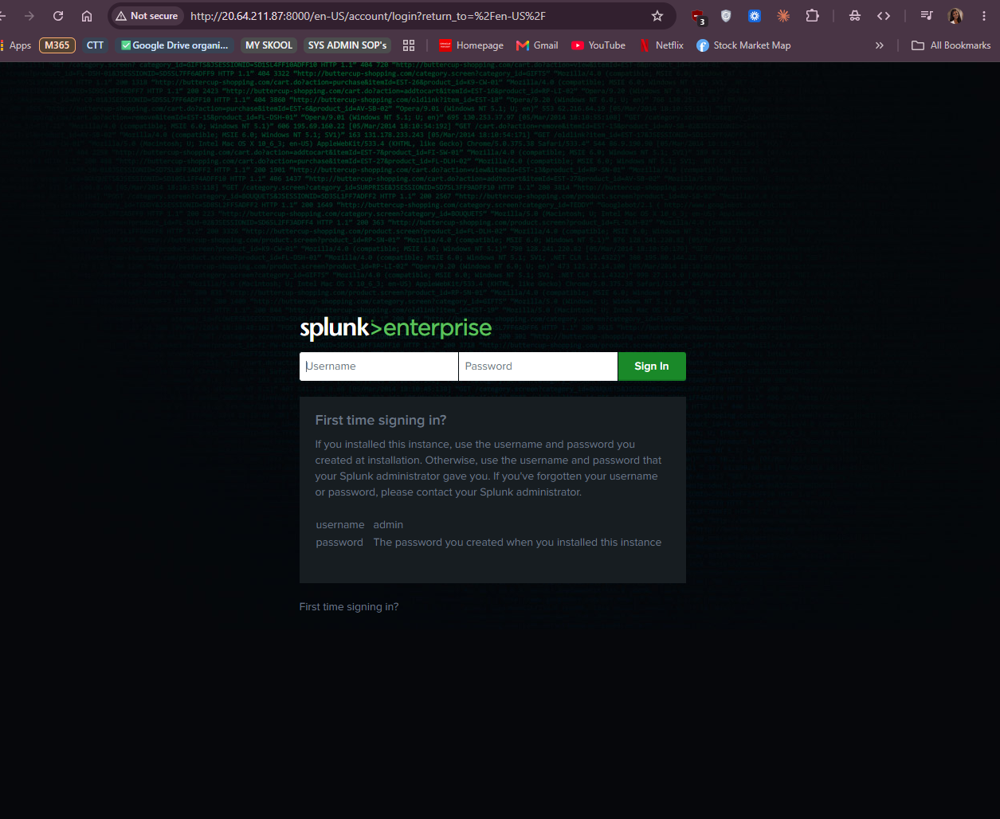

**Configure receiving port and create the index:**

1. **Settings → Forwarding and Receiving → Configure Receiving → New Receiving Port → `9997` → Save**
2. **Settings → Indexes → Create New Index → Name: `windows_logs` → Save**

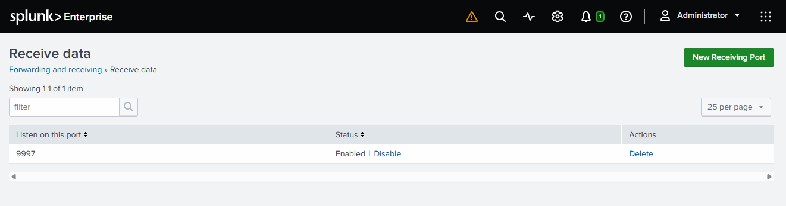

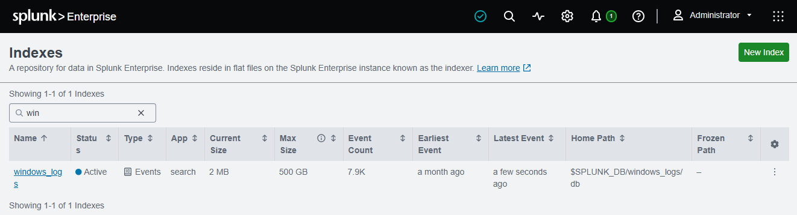

---

### 5. Install Universal Forwarder on DC01

RDP into DC01, then from a browser on DC01:

1. Go to [splunk.com/en_us/download/universal-forwarder.html](https://splunk.com/en_us/download/universal-forwarder.html)
2. Download **Windows 64-bit installer (.msi)**
3. Run the installer — when prompted:
   - **Deployment Server:** Splunk VM private IP · port `8089`
   - **Receiving Indexer:** Splunk VM private IP · port `9997`
4. Complete with default settings

**Create `inputs.conf` to define which logs to collect.** Open Notepad as Administrator on DC01 and save this file to the exact path:  
`C:\Program Files\SplunkUniversalForwarder\etc\system\local\inputs.conf`

See the full file at [`scripts/inputs.conf`](scripts/inputs.conf). Then restart the forwarder:

```powershell
# Run as Administrator on DC01
Restart-Service SplunkForwarder
```

Verify data is flowing — run this in the Splunk search bar:

```
index=windows_logs | head 10
```

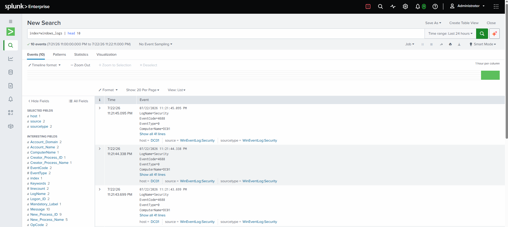

---

### 6. Run Essential SPL Searches

All searches run in the **Search & Reporting** app. See [`scripts/spl-searches.md`](scripts/spl-searches.md) for the full set with explanations.

| Search | Purpose |
|---|---|
| `index=windows_logs \| head 100` | Confirm data is flowing |
| `EventCode=4625 \| stats count by Account_Name` | Failed login attempts — brute force indicator |
| `EventCode=4624 \| stats count by Account_Name, Logon_Type` | Successful logins by type |
| `EventCode=4740 \| table _time, Account_Name, Caller_Computer_Name` | Account lockouts |
| `EventCode=4625 earliest=-24h \| stats count as failures \| head 10` | Top 10 targeted usernames |
| After-hours filter with `eval hour` | Logins outside 7am–7pm |

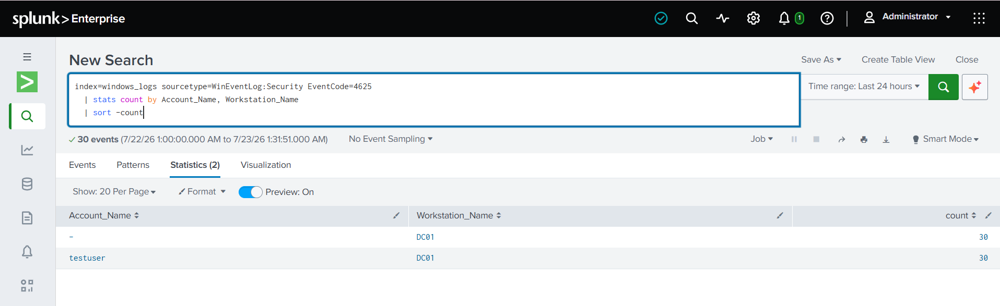

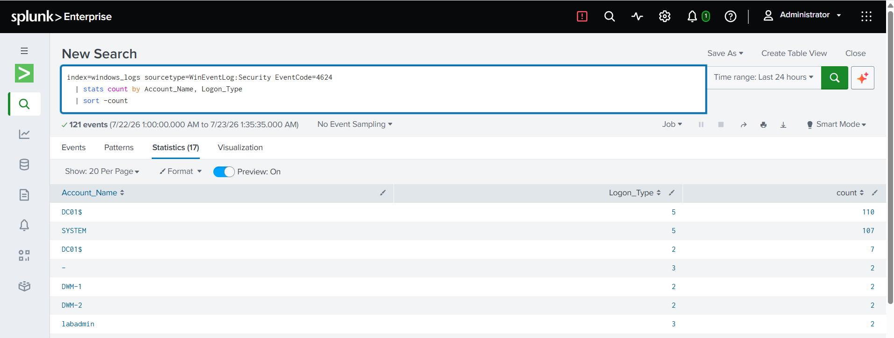

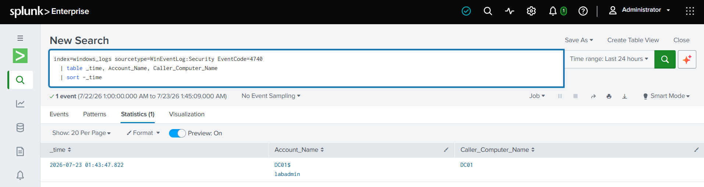

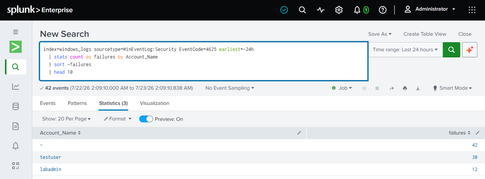

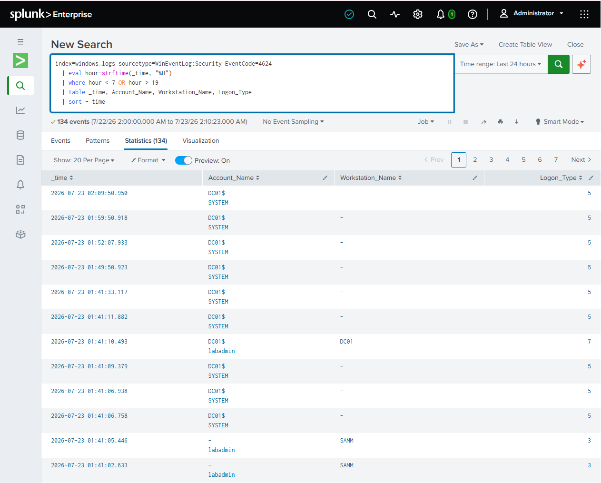

---

### 7. Build the Security Dashboard

1. **Dashboards → Create New Dashboard**
2. Name: `Windows Security Overview` → Create Dashboard
3. Add 4 panels using **Add Panel**:

| Panel | Search | Visualization |
|---|---|---|
| Failed Logins — Last 24h | `EventCode=4625 \| stats count by Account_Name` | Bar chart |
| Account Lockouts — Last 7d | `EventCode=4740 \| table _time, Account_Name, Caller_Computer_Name` | Events list |
| Login Activity Over Time | `EventCode=4624 \| timechart count` | Line chart |
| Top Source Machines — After Hours | After-hours search `\| stats count by Workstation_Name` | Column chart |

4. Save the dashboard.

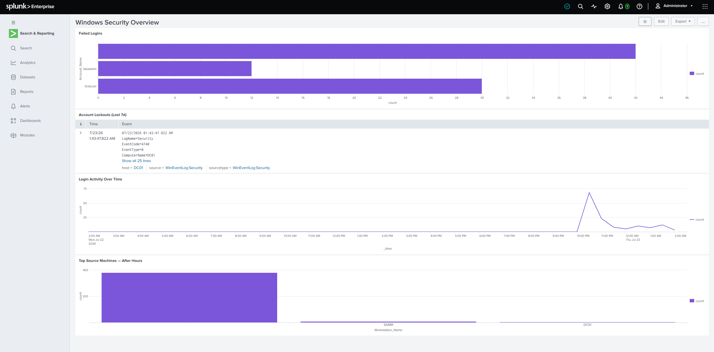

---

### 8. Create an Automated Brute Force Alert

Run this search first to confirm it returns results (intentionally type the wrong password 10+ times on DC01 to generate events):

```
index=windows_logs sourcetype=WinEventLog:Security EventCode=4625
| stats count as failures by Account_Name
| where failures > 10
```

Then save as an alert: **Save As → Alert**

| Setting | Value |
|---|---|
| Name | Potential Brute Force — High Failure Count |
| Alert type | Scheduled |
| Run every | 15 minutes |
| Trigger condition | Number of Results > 0 |
| Trigger actions | Add to Triggered Alerts |

Verify: **Settings → Searches, Reports, and Alerts** → alert shows Status: Enabled.

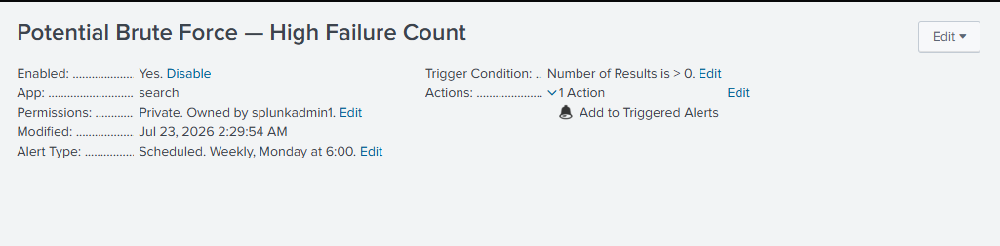

---

### 9. Commit and Push to GitHub

After completing all steps and saving screenshots to the `screenshots/` folder:

```powershell
git add .
git commit -m "feat: splunk lab3 — siem deployment, spl searches, dashboard, brute force alert"
git push
```

---

## Key Skills Demonstrated

- Azure CLI provisioning of two-VM architecture with shared VNet and per-VM NSG rules
- SSH from PowerShell to Linux VM — no additional client required
- Splunk Enterprise installation and configuration on Ubuntu 22.04
- Splunk receiving port and index configuration via the web UI
- Universal Forwarder installation and `inputs.conf` configuration on Windows Server
- SPL query writing — `stats`, `sort`, `head`, `table`, `timechart`, `eval`, `where`
- Security dashboard construction with multiple panel types
- Scheduled alert creation for automated brute-force detection
- Windows Event ID analysis — 4624 (logon), 4625 (failed logon), 4740 (lockout)
- Git version control and GitHub portfolio management via CLI

---

## Cleanup

To avoid ongoing Azure charges, delete the resource group when the lab is complete.

```powershell
az group delete --name rg-lab03-0626 --yes --no-wait
```
